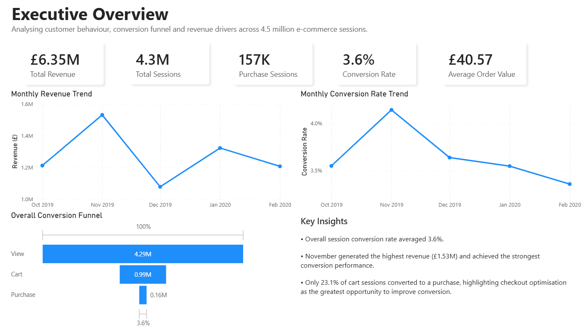
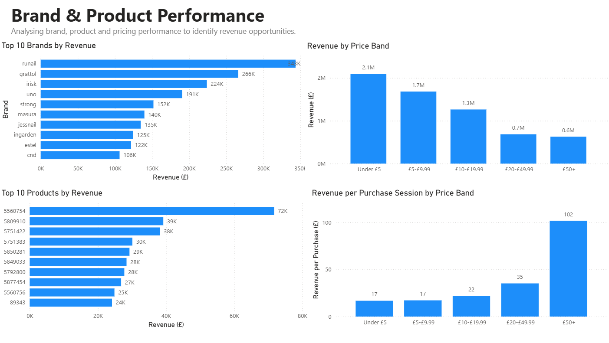
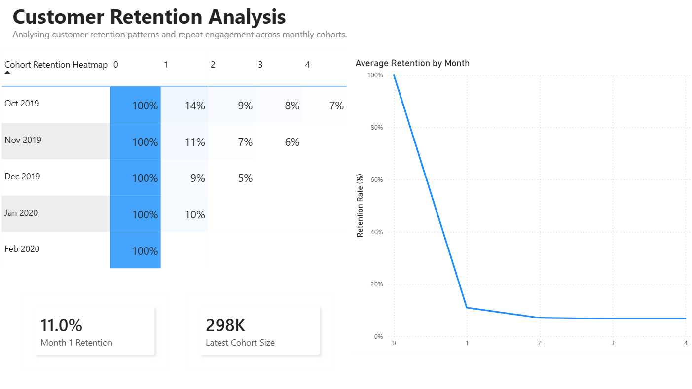
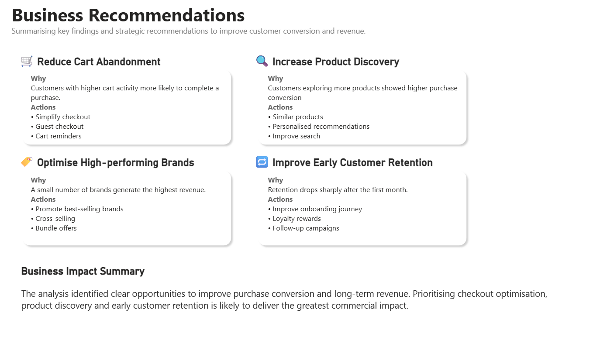

# E-commerce Product Analytics: Conversion Funnel, Retention & Revenue Drivers

An end-to-end e-commerce analytics project using PostgreSQL, SQL, Python and Power BI to analyse customer behaviour, purchase conversion, product performance, revenue drivers and cohort retention.

The project answers a core business question:

> Which customer behaviours are most strongly associated with purchase conversion, and what actions can improve conversion and long-term revenue?

---

## Project Overview

This project analyses customer event data from an online cosmetics shop. The analysis starts from raw event-level data and transforms it into business-ready tables for funnel analysis, behavioural conversion analysis, revenue performance, cohort retention and Power BI reporting.

The final Power BI dashboard is structured as a five-page business report:

1. **Executive Overview**
2. **Customer Behaviour Analysis**
3. **Brand & Product Performance**
4. **Customer Retention Analysis**
5. **Business Recommendations**

---

## Dataset

**Source:** [eCommerce behaviour data from Kaggle](https://www.kaggle.com/datasets/mkechinov/ecommerce-events-history-in-cosmetics-shop)

The dataset contains e-commerce event history from a cosmetics shop, including customer sessions, product views, cart activity, remove-from-cart events and purchases.

**Note:** Raw CSV files are excluded from this repository due to GitHub file size limits. To reproduce the project, download the dataset directly from Kaggle and place the raw CSV files in your local data folder.

---

## Power BI Dashboard

The Power BI dashboard (`.pbix`) can be downloaded from the **Releases** section of this repository.

The dashboard was built using cleaned and aggregated PostgreSQL tables rather than raw CSV files, following a more realistic analytics workflow.

---

## Tools Used

- **PostgreSQL / SQL**: data cleaning, transformation, aggregation and analysis
- **Python**: statistical testing and supporting analysis
- **Power BI**: dashboard design, data modelling and business reporting
- **GitHub**: version control and project documentation

---

## Key Business Questions

This project focuses on the following questions:

- What is the overall conversion funnel from product view to cart to purchase?
- Which customer behaviours are associated with higher purchase conversion?
- How do cart activity, product exploration and session duration relate to purchase intent?
- Which brands, products and price bands generate the most revenue?
- How does customer retention change across monthly cohorts?
- What business actions could improve conversion and long-term revenue?

---

## Dashboard Pages

### 1. Executive Overview

The Executive Overview provides a high-level summary of customer activity, conversion and revenue.

Key metrics include:

- **Total Revenue:** £6.35M
- **Total Sessions:** 4.3M
- **Purchase Sessions:** 157K
- **Overall Conversion Rate:** 3.6%
- **Average Order Value:** £40.57

Visuals include monthly revenue trend, monthly conversion trend, overall conversion funnel and key business insights.

---

### 2. Customer Behaviour Analysis

This page analyses how customer behaviour intensity relates to purchase conversion.

Key findings:

- Sessions with **11+ cart additions** achieved the highest conversion rate at **24.3%**.
- Sessions with **10+ minutes** duration converted at **16.1%**, compared with **0.5%** for sessions under one minute.
- Remove-from-cart activity was not necessarily negative. Higher remove activity was associated with higher conversion, suggesting that active product comparison may be a sign of purchase intent.
- Product exploration alone was weaker than cart activity as a conversion signal.

This page uses behaviour buckets to compare conversion rates across views, carts, remove-from-cart activity and product exploration.

---

### 3. Brand & Product Performance

This page identifies the brands, products and price bands that contribute most strongly to revenue.

Key findings:

- Top revenue brands included **runail**, **grattol**, **irisk**, **uno** and **strong** after excluding unknown brands.
- Lower price bands generated the largest total revenue.
- Higher price bands generated higher revenue per purchase session.
- Products are analysed using `product_id` because product names are not available in the original dataset.

Visuals include:

- Top 10 brands by revenue
- Revenue by price band
- Top 10 products by revenue
- Revenue per purchase session by price band

---

### 4. Customer Retention Analysis

This page analyses monthly cohort retention.

Key findings:

- Average Month 1 retention was approximately **11%**.
- Retention dropped sharply after the first month.
- Longer-term retention stabilised at a low level across the available cohorts.
- The latest cohort size was approximately **298K** customers.

A cohort retention heatmap was created using a Power BI matrix with conditional formatting.

---

### 5. Business Recommendations

The final page translates the analysis into business actions.

Recommended actions include:

#### Reduce Cart Abandonment
Customers with higher cart activity were more likely to complete a purchase.

Actions:
- Simplify checkout
- Enable guest checkout
- Send abandoned cart reminders

#### Increase Product Discovery
Customers exploring more products showed higher purchase conversion.

Actions:
- Add similar product recommendations
- Improve personalisation
- Improve search and discovery

#### Optimise High-performing Brands
A small number of brands generated the highest revenue.

Actions:
- Promote best-selling brands
- Increase visibility of high-performing brands
- Use cross-selling and bundle offers

#### Improve Early Customer Retention
Retention dropped sharply after the first month.

Actions:
- Improve onboarding journey
- Introduce loyalty rewards
- Run follow-up campaigns

---

## Data Preparation and Modelling

The project follows a structured workflow:

1. Import raw event data into PostgreSQL
2. Clean and standardise event records
3. Build session-level customer journey features
4. Create aggregated analysis tables
5. Run statistical testing in Python
6. Connect curated tables to Power BI
7. Build interactive dashboard pages
8. Translate findings into business recommendations

Key derived tables include:

- `clean_events`
- `session_journey`
- `monthly_conversion_funnel`
- `behaviour_conversion_summary`
- `brand_performance`
- `product_performance`
- `price_band_performance`
- `cohort_retention`
- `session_duration_conversion`

---

## Analysis Highlights

### Conversion Funnel

The dashboard tracks the customer journey across view, cart and purchase stages. The overall session conversion rate was low, showing that most sessions did not result in purchase.

### Behaviour Drivers

Cart activity was the strongest behavioural signal of purchase intent. Sessions with higher cart counts consistently showed higher conversion rates.

### Product Exploration

Customers who explored more products were more likely to convert than customers viewing only one product. This suggests that product discovery features could support conversion.

### Price Band Performance

Lower-priced products generated the greatest total revenue, while higher-priced products produced stronger revenue per purchase session.

### Retention

Customer retention fell sharply after Month 1, suggesting an opportunity to improve onboarding, follow-up campaigns and loyalty initiatives.

---

## Data Quality Notes

During analysis, some session durations were found to be unusually long because certain `user_session` values appeared to span multiple days. Session duration was still used for directional behavioural analysis, but this limitation should be considered when interpreting duration-based metrics.

The dataset also contains missing or unknown brand and category values. Unknown brands were excluded from the Top 10 brand revenue visual to avoid masking meaningful brand-level performance.

---

## Repository Notes

Raw CSV files are not included in this repository because they exceed GitHub file size limits.

To reproduce the analysis:

1. Download the dataset from Kaggle.
2. Load the CSV files into PostgreSQL.
3. Run the SQL scripts in order.
4. Open the Power BI dashboard from the Releases section or connect Power BI to the generated PostgreSQL tables.

---

## Project Outcome

This project demonstrates an end-to-end analytics workflow, from raw event data to business recommendations. It combines SQL-based data modelling, behavioural analysis, cohort retention analysis, Power BI dashboarding and commercial interpretation.

The final dashboard provides a clear business narrative:

> Overall performance → customer behaviour → product and revenue drivers → retention → recommended business actions.
